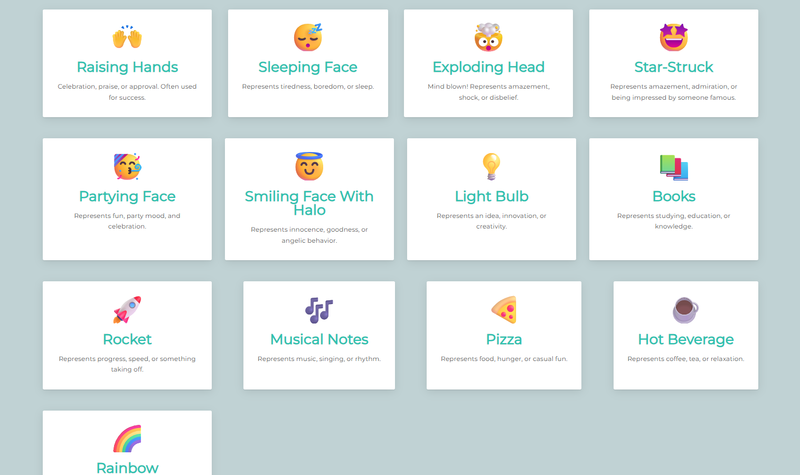

# 📖 Emojipedia (React.js Project)

Emojipedia is a simple **React.js project** that displays emoji meanings in a fun and interactive way.  
It demonstrates **React components, props, mapping arrays, and modular code structure**.

---

## 📸 Screenshots  

| Home View | Emoji Entries |
|-----------|---------------|
|  |  |

---

## 🛠️ Tech Stack
- **React.js** (Frontend library)  
- **JavaScript (ES6)**  
- **CSS3** (Styling)  
- **Vite / Create React App** (Build & Dev server)  

---

## ⚛️ React Installation & Application Setup

## 📦 Installation


Install the node modules
```bash
npm install
```

Launch your React project in your browser
```bash
npm run dev
```
